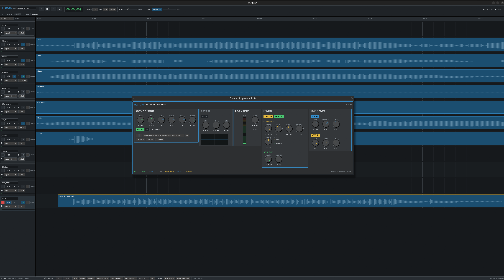

<div align="center">


# RustDAW

**An audio recorder and digital audio workstation for Ubuntu, written in Rust.**

[](https://github.com/DSPROPT/RustDAW/actions/workflows/ci.yml)
[](LICENSE)
[](https://www.rust-lang.org/)
[](#install-on-ubuntu)

</div>

Multitrack recording through a Focusrite Scarlett Solo, non-destructive editing,
a console mixer, a channel strip with EQ / compressor / gate / delay / reverb,
Neural Amp Modeler guitar amps, a General MIDI synthesiser written from scratch,
a piano roll, an instrument tuner, reference mastering, and native tempo, beat
and chord detection that holds its own against commercial tools.



<div align="center">
<sub>A song imported as separated stems, with the channel strip open on a guitar
track: a NAM capture of a Peavey 5150 through a Marshall cabinet, 3-band EQ,
compressor, noise gate, delay and reverb — and the source WAV still dry.</sub>
</div>

**27,566 lines of Rust across 13 workspace packages, 379 tests, 18 released `.deb`
packages — built by one person in about 50 hours, directing
[Claude Code](https://claude.com/claude-code).**

The story of how that happened is in [How this was built](#how-this-was-built)
and [The timeline](#the-timeline). Everything above it is the manual.

---

## Contents

- [Install on Ubuntu](#install-on-ubuntu)
- [Build from source](#build-from-source)
- [Recording and editing](#recording-and-editing)
- [Mixing, effects, and guitar amps](#mixing-effects-and-guitar-amps)
- [MIDI, the piano roll, and tempo](#midi-the-piano-roll-and-tempo)
- [Instruments and chords](#instruments-and-chords)
- [Tuner](#tuner)
- [Reference mastering](#reference-mastering)
- [Song import](#song-import)
- [Building the package yourself](#building-the-package-yourself)
- [Architecture](#architecture)
- [How this was built](#how-this-was-built)
- [The timeline](#the-timeline)
- [What one person can build now](#what-one-person-can-build-now)

---

## Install on Ubuntu

No Rust toolchain needed. Download the package and install it:

```bash
wget https://github.com/DSPROPT/RustDAW/raw/main/dist/rustdaw_0.8.0_amd64.deb
sudo apt install ./rustdaw_0.8.0_amd64.deb
```

Then launch **RustDAW** from the applications menu, or run `rustdaw` from a
terminal.

`apt` pulls the runtime libraries in for you (`libasound2`, `libpulse0`,
`libgl1`). Requirements: **Ubuntu on x86-64**, PipeWire or PulseAudio, and an
audio interface — it is developed against a Focusrite Scarlett Solo 4th Gen, but
any interface your system exposes will work.

Two optional extras unlock the rest:

```bash
sudo apt install ffmpeg                  # song import (sample-rate conversion)
sudo apt install fluid-soundfont-gm      # a real SoundFont for instrument tracks
```

Neither is required. Without ffmpeg everything except song import works; without
a SoundFont, instrument tracks play through the General MIDI bank
[synthesised in Rust](#instruments-and-chords).

To remove it:

```bash
sudo apt remove rustdaw
```

Every release from 0.1.0 onward is kept in [`dist/`](dist/) — see
[the timeline](#the-timeline) for what each one was.

## Build from source

```bash
git clone --recurse-submodules https://github.com/DSPROPT/RustDAW.git
cd RustDAW
sudo apt install build-essential libasound2-dev libpulse-dev \
  libgl1-mesa-dev libgtk-3-dev libxkbcommon-dev
cargo test --workspace
cargo run -p rustdaw
```

If you already cloned without `--recurse-submodules`, fetch
NeuralAmpModelerCore and its Eigen dependency before building:

```bash
git submodule update --init --recursive
```

To see what your machine exposes before opening a stream:

```bash
cargo run -p hardware-probe
```

The hardware probe is read-only: it lists audio hosts, devices, default stream
formats, and supported channel/sample-rate ranges. It does not open a stream.

Everything above works with no configuration. The only optional step is
supplying your own TONE3000 key if you want in-app amp downloads — see
[Bring your own TONE3000 credentials](#bring-your-own-tone3000-credentials).

## Recording and editing

The desktop application opens the Scarlett through PipeWire's PulseAudio
compatibility service. In the edit window you can add mono/stereo tracks, select
one of four capture channels, arm a track, enable the click, and record 24-bit
WAV takes into `Recordings/`. Recorded clips play from their sample-accurate
timeline positions. `Ctrl+S` saves the current versioned session to
`Sessions/Current.rustdaw.json`; it is restored on the next launch. Select a clip
and press `Delete` to remove it non-destructively (the WAV is preserved).

Use **AUDIO SETTINGS** in the bottom bar to select PipeWire input/output devices,
change the buffer size, test outputs 1–2, and identify the Scarlett's backend
capture channels with live meters. Device choices and custom channel labels are
saved in `~/.config/rustdaw/audio.json`.

Drag one or more 48 kHz mono/stereo WAV files onto the edit window, or use
**IMPORT AUDIO** to choose them in Ubuntu's file explorer. Each imported file
creates a track at the current playhead. **SAVE AS** writes a named `.rustdaw`
session, while **OPEN SESSION** switches projects with unsaved-change protection.
Shortcuts: `Ctrl+O` opens a session and `Ctrl+Shift+S` saves as.

Track **M** and **S** buttons update mute/solo audibility immediately during
playback without reloading imported stems. Multiple tracks may be soloed, mute
overrides solo, and the same mixer state is saved in sessions and honored by
stereo export.

Imported and recorded media is preloaded whenever a session changes, so the
transport starts immediately when **Play** is pressed. Drag a clip horizontally
to change its timeline position, or vertically onto another audio track to move
it between tracks. Moving uses a real-time engine command and does not reload or
reprocess the WAV. The red **×** in a track header removes that track after a
confirmation; source WAV files are always preserved.

Tracks and clips have persistent UUIDs, including automatic migration when an
older session is opened. Decoded WAV data is retained in a shared immutable
cache: on the eight-stem reference session, the first release-mode load takes
about 3 seconds and subsequent playback schedule rebuilds take approximately
0.005 ms. Clip moves and keyboard nudges use UUID-based edit commands and can be
reversed with **UNDO** / `Ctrl+Z`, then restored with **REDO** / `Ctrl+Shift+Z`.

For a two-second command-line recording check using Scarlett Input 2:

```bash
cargo run -p daw-audio-linux --example recording-smoke
```

Run the hardware soak test for a chosen number of seconds (60 by default):

```bash
cargo run -p daw-audio-linux --example recording-soak -- 60
```

## Mixing, effects, and guitar amps

Open the floating **MIX** window from the bottom bar or with `Ctrl+M`. It
provides a horizontally scrolling console strip for every track: insert access,
send placeholders, I/O labels, real-time pan, Mute/Solo, vertical gain fader, and
independent playback meter. Mixer controls update the audio thread immediately
and pan is persisted and included in stereo export.

Each track has an **FX** insert button. The chain is:

```text
GATE → AMP → TONE → EQ → COMPRESSOR → DELAY → REVERB
```

- **EQ** — multiband channel EQ with a live response graph.
- **COMPRESSOR** and **GATE** — console-style dynamics with activity indicators.
- **TONE** — an amplifier tone stack (bass / middle / treble), deliberately
  separate from the channel EQ. The tone stack is part of the amplifier and sits
  between preamp and power stage; the channel EQ shapes the track against the
  rest of the mix. Controls run 0–10 and are flat at 5, the way amp markings do.
- **DELAY** — one delay line per channel with a smoothed read head, so turning
  the time knob produces the tape-delay pitch bend people actually want instead
  of a click.
- **REVERB** — a stereo room on the instrument bus. A synthesised note played
  perfectly dry is the one cue no amount of voice work removes, because the ear
  reads the absence of early reflections as "this was never in a room."

Effects are non-destructive: they process software monitoring, timeline playback,
and stereo exports while recorded WAV files remain dry. Insert settings are
stored in the session document. Parameters are applied block-by-block in the
real-time audio engine — turning a control sends a bounded parameter command and
never reloads or reprocesses an entire WAV file.

The channel-strip window uses console-style rotary controls, illuminated module
switches, a live segmented input meter, an EQ response graph, and dynamics
activity indicators — [pictured at the top of this page](docs/images/channel-strip.png).

### NAM guitar amps

Audio tracks can enable the **NAM GUITAR AMP** module in the FX window. Choose a
`.nam` capture, then use INPUT and OUTPUT calibration around the model. NAM is
instantiated only for tracks where it is enabled; model loading and prewarming
stay off the real-time audio callback. The amp is applied to live software
monitoring, timeline playback, and stereo export, and its path and settings are
saved with the session. NAM captures must match the session sample rate
(normally 48 kHz).

Captures are chosen from a menu rather than a file dialog. Drop `.nam` files into
`Amps/` beside `Recordings/` and `Sessions/` — nested folders are searched, so a
downloaded pack can be unzipped as it comes — and they appear in the amp module's
list. **RESCAN** picks up whatever has arrived since. A collection kept elsewhere
is found too (`~/Documents/NAM`, `~/NAM`, `~/.nam`), or point `RUSTDAW_AMP_MODELS`
at it. To see what RustDAW can find:

```bash
cargo run -p daw-nam --example list-amps
```

**GET AMPS** loads a capture from [TONE3000](https://www.tone3000.com/), where
thousands are shared for free. Given a publishable key it opens TONE3000's own
picker in the browser, waits for you to choose, and drops the capture straight
onto the track; without one it just opens the site to download by hand.

### Bring your own TONE3000 credentials

**RustDAW ships no TONE3000 key, and cannot use anyone else's.** The key
identifies *your* application to TONE3000 and is tied to *your* account, so
every person building RustDAW registers their own. This is a deliberate choice,
not a missing feature: a shared key baked into a public repository would be
extracted from the first binary someone downloaded and used until TONE3000
revoked it.

To set yours up:

1. Register an application at [tone3000.com](https://www.tone3000.com/) and copy
   its **publishable** key (the one beginning `t3k_pk_`).
2. Register `http://localhost:3001` as the application's redirect URI. If you
   register a different port, set `TONE3000_REDIRECT_PORT` to match.
3. Copy the template and fill in your key:

```bash
cp .env.example .env
$EDITOR .env          # TONE3000_PUBLISHABLE_KEY=t3k_pk_…
```

The build script reads `.env` at the workspace root and compiles the key in.
`.env` is git-ignored — keep it that way, and never commit or share it.

To check the link works without signing in:

```bash
cargo run -p daw-tone3000 --example check-link
```

**Skipping this is fine.** With no key, everything else in RustDAW works
unchanged and **GET AMPS** simply opens tone3000.com in your browser so you can
download captures by hand into `Amps/`.

> **Never put your TONE3000 secret key in `.env`.** It is a server credential,
> and anything compiled into a desktop binary can be read straight back out of
> it with `strings` — so a secret key placed there is published to everyone you
> give a build to. Sign-in uses OAuth with PKCE, which needs the publishable key
> alone. The build script enforces this: it reads `TONE3000_PUBLISHABLE_KEY` and
> ignores every other variable in the file.

Captures are not bundled: they belong to the people who made them, and TONE3000's
terms permit downloading one at a user's request but not redistributing,
mirroring or bundling their catalogue.

NeuralAmpModelerCore is pinned as a Git submodule. After cloning RustDAW, fetch
it and its Eigen dependency before building:

```bash
git submodule update --init --recursive
```

## MIDI, the piano roll, and tempo

Instrument tracks hold notes rather than audio and are played by a SoundFont or
the built-in synth (see [Instruments and chords](#instruments-and-chords)). Open
the **PIANO ROLL** from the bottom bar, or double-click a MIDI clip in the
timeline: double-click adds a note, drag moves it, its right edge changes the
length, `Del` removes it, and the grid snaps to anything from whole notes to
1/32. Velocity sets each note's brightness as well as its level. Notes are stored
in ticks, not seconds, so changing the tempo moves the notes and leaves recorded
audio where it is.

Sessions carry a **tempo map**. A song at one steady tempo stores one entry; a
song that really moves stores the changes and the bar lines follow. Session files
are version 2 — version 1 sessions open unchanged and gain a constant tempo map
at their stored tempo.

**Tempo is detected natively**, from the audio, in Rust: spectral-flux onsets
over an in-house FFT, a global tempo chosen by autocorrelation with harmonic
summation and a perceptual prior, then beats fitted by dynamic programming.
Deciding one tempo first and fitting beats to it is what keeps a steady song at
one tempo instead of recording the tracker's own error as tempo change.

```bash
cargo run --release -p daw-analysis --example detect-tempo -- drums.wav
cargo run -p daw-midi --example dump-midi -- song.mid
```

Measured against the kick-drum onsets of real songs, where 25% of a beat is what
random alignment scores:

| Song | RustDAW | DSPRO Studio | librosa |
|---|---|---|---|
| King Von — Armed & Dangerous | **15.6%** | 24.3% | 23.6% |
| Bruno & Marrone — Bijuteria | **12.5%** | 24.1% | 16.4% |
| Zezé Di Camargo — No Dia em Que Eu Saí de Casa | **5.8%** | 24.7% | 24.5% |

## Instruments and chords

Instrument tracks play from a **SoundFont** when one is installed, and from a
**General MIDI bank synthesised in Rust** when one is not. Imported MIDI keeps
the program each track asks for, and drum tracks land on the kit either way.

Any `.sf2` file works. RustDAW looks in the usual places — `/usr/share/soundfonts`,
`/usr/share/sounds/sf2` — so installing your distribution's package is enough:

```bash
sudo apt install fluid-soundfont-gm      # Debian, Ubuntu
sudo pacman -S soundfont-fluid           # Arch
```

To use one kept somewhere else, point `RUSTDAW_SOUNDFONT` at it. The audio
settings panel shows which is playing. Nothing is downloaded and nothing is
bundled: with no SoundFont anywhere, the synthesised bank plays and the session
still opens.

To check what will be picked up, and that its levels line up with the synthesised
bank:

```bash
cargo run -p daw-engine --release --example check-soundfont
```

The synthesised bank covers all 128 programs plus the channel-10 kit, and is
built to sound like instruments rather than like a synthesiser: exponential
envelopes, band-limited wavetables mip-mapped per octave so a bass note keeps its
harmonics, decay that tracks the keyboard the way a piano's does, a noise
transient at every onset for the hammer or the pick or the breath, detuned unison
spread across the stereo field, per-note variation in tuning and timbre so no two
hits are identical, and a shared reverb bus behind all of it. A piano decays on
its own, an organ holds, a flute is mostly breath, and a kick is not a low beep.
Every program is level-matched to within a few decibels of the rest.

To hear the whole bank at once — and, when a SoundFont is installed, each
instrument played twice so the two can be compared back to back:

```bash
cargo run -p daw-engine --release --example audition-bank -- bank.wav
cargo run -p daw-engine --release --example audition-bank -- --synth bank.wav
```

**Chords are detected natively too.** A chromagram with the harmonic series
discounted, averaged over half-beats from the detected beat grid, matched against
ten chord qualities and decoded by Viterbi so the chart holds still instead of
flickering between relative keys. The key comes from Krumhansl–Schmuckler
profiles and the bass register is read separately, which is what names inversions
like `D/F#`. Drums and vocals are excluded from the input: percussion has no
pitch, and a singer's passing notes are not the chord.

Scored against each song's independently transcribed MIDI — what fraction of
sounding note-time the chart actually explains:

| Song | RustDAW | DSPRO Studio |
|---|---|---|
| Zezé Di Camargo — No Dia em Que Eu Saí de Casa | **66.1%** | 66.5% |
| Andre Renner — Será Que Está Pensando Em Mim | 72.1% | **74.5%** |
| King Von — Armed & Dangerous | **63.4%** | 54.5% |
| Leonardo — Pot Pourri | 39.3% | **40.0%** |

Ahead on average, and much further ahead on the trap track, where the song is one
sustained harmony and a chart with 155 chord changes is describing noise.

```bash
cargo run --release -p daw-analysis --example detect-chords -- <project-dir>
```

## Tuner

**TUNER** in the bottom bar opens a needle dial that reads the armed input: the
note, the cents off, and a reference-pitch control for tuning to something other
than A=440. A **BASS** switch drops the bottom of the search range below a
five-string bass's low B, and a **REACTIVITY** control trades a needle that
responds quickly against one that sits still.

The detector is **YIN**, in the time domain — not an FFT. A guitar's low E is
82 Hz and its drop-D is 73, and telling one cent from the next there means
resolving about 0.05 Hz; a transform would need a twenty-second window to do that
from bin spacing alone. YIN's normalised difference function, with the winning
dip interpolated to a fraction of a sample, gets accuracy at the bottom of the
range and immunity to the octave errors a spectral peak-picker makes on a plucked
string, where the second harmonic is routinely louder than the fundamental.

Readings are smoothed before they are drawn — a new note snaps, the same note is
followed — because pitch on a plucked string is noisy for the first moments while
the harmonics settle.

## Reference mastering

**MASTER…** in the bottom bar, next to **EXPORT MIX**, matches your bounce to a
record you want yours to sound like. Pick a WAV at the session rate and the
export is measured against it and brought to meet it — loudness, tone, stereo
width and peaks. Right-click the button to go back to exporting the mix dry.
The choice is saved with the session.

It is not a mastering engineer. What it does is the part of the job that is
measurement rather than judgement:

1. **Levels.** The loudest parts of both songs — the choruses, not the intros —
   are found and matched, so the tonal comparison that follows is between two
   songs at the same level.
2. **Tone.** The average spectrum of each is taken and divided, giving the EQ
   curve that turns one into the other. That curve is resampled onto a
   logarithmic frequency grid before it is smoothed, because ears hear
   frequency logarithmically and smoothing on the FFT's linear grid would leave
   the bass untouched and scrub the treble flat. Smoothed with LOWESS, so the
   filter follows the broad tonal difference and ignores the spikes — following
   the raw ratio builds a comb filter that rings.
3. **Levels again**, four times, because equalising moves them.
4. **Peaks**, through a brickwall limiter whose gain envelope is the maximum of
   a hard-clip curve, a zero-phase attack curve that starts reducing *before*
   the peak arrives, and a hold/release curve that rides a run of peaks instead
   of pumping between them.

Mid and side are carried separately the whole way, each with its own EQ curve.
That is what matches stereo width: a wider reference produces a side curve that
lifts the side channel, and the mix widens without anything being told to widen.

```bash
cargo run --release -p daw-master --example master-to-reference -- \
    mix.wav reference.wav mastered.wav
```

The algorithm is [Matchering](https://github.com/sergree/matchering) by Sergree,
GPL-3.0, © 2016-2022 — **ported to Rust**, not called out to. RustDAW is
GPL-3.0-or-later, so the licence permits the port outright. Verified against
upstream on the same pair of files at 48 kHz:

| | Upstream Matchering | RustDAW |
|---|---|---|
| Peak | −0.45 dBFS | −0.45 dBFS |
| RMS | −14.74 dBFS | −14.74 dBFS |
| Tonal distance to the reference | 1.08 dB | **1.08 dB** |
| Mean spectral difference from upstream | — | **0.01 dB** |
| Waveform correlation with upstream | — | **1.0000** |

The unmastered mix sits 4.20 dB from the reference's tone; both bring it to
1.08 dB. Eight seconds of audio masters in 0.08 s.

Two deliberate differences from upstream. It runs at the **session's sample
rate** rather than resampling to 44.1 kHz, because the engine refuses to
resample media and would rather master at 48 kHz than convert twice around a
fixed-rate stage — every constant is specified in milliseconds or hertz, so
they carry over unchanged. And there is **no Python**: the FFT, the cubic
spline, the LOWESS smoother and the limiter are all in
[`crates/daw-master`](crates/daw-master), so mastering works on a machine with
nothing installed.

## Song import

**IMPORT SONG** in the bottom bar turns a song into instrument tracks you can play
along with. Paste a link and the song is downloaded and separated on this machine
(a CUDA GPU or Apple Silicon where available, otherwise the CPU) into drums, bass,
guitar, piano, other and vocals; each stem becomes a stereo track, and the session
tempo and meter come from the detected beat grid. Songs that have already been
processed are listed in the same window and import in about a second, because only
format conversion is left to do.

When transcription is available, it is imported too: each pitched MIDI track
becomes an instrument track you can edit in the piano roll and hear against the
stems, and channel-10 tracks become drum tracks played by the kit. They come in at
-9 dB: the stems are the reference, and the transcription is there to be brought up
against them. Tempo comes from the detector above rather than from the pipeline's
beat grid, and the notes are rebased through seconds so a transcription written at
120 BPM still lines up when the song turns out to be 94. Transcription
(basic-pitch) is optional: it installs on Ubuntu and on macOS with Python
3.10/3.11, and is simply skipped elsewhere, in which case a song imports as stems
only.

The separation itself is Demucs and the transcription is basic-pitch, run by a
self-contained Python worker that ships in this repo under
[`crates/daw-songimport/worker`](crates/daw-songimport/worker). Install it once per
machine — the same script works on macOS and Ubuntu:

```bash
crates/daw-songimport/worker/install.sh
```

It creates a virtualenv under the platform's data directory
(`~/Library/Application Support/chords-extraction` on macOS,
`~/.local/share/chords-extraction` on Linux) and drops a launcher RustDAW finds
automatically. RustDAW talks to the worker over loopback HTTP and starts it if it
is not answering; nothing is uploaded anywhere. The heavy model checkpoints
(~2–3 GB) download on the first real import, not at install time. Set
`CHORDS_STUDIO_LAUNCHER` if the launcher lives somewhere unusual, or
`CHORDS_STUDIO_DATA` to relocate the whole install.

Verify the RustDAW↔worker wiring without any model download by importing a
synthetic project:

```bash
# Create a self-test project, then import it from the command line.
"$HOME/.local/share/chords-extraction/venv/bin/python" \
  "$HOME/.local/share/chords-extraction/app/store.py" --self-test
cargo run -p daw-songimport --example import-song -- <printed-id>
```

Stems are produced at 44.1 kHz, so they are converted once at import to the
session's rate with ffmpeg and written into `Songs/<name>/Audio/` as 24-bit WAV —
the engine refuses mismatched media rather than resampling during playback. Expect
roughly 200–300 MB per song. Silent stems are skipped, and by default the song is
delayed by less than a bar so its first downbeat lands on bar 1 of the click.

Import a song without the desktop app:

```bash
cargo run -p daw-songimport --example import-song              # list processed songs
cargo run -p daw-songimport --example import-song -- <id>      # import one
cargo run -p daw-songimport --example import-song -- <url>     # separate, then import
```

## Building the package yourself

To install a prebuilt release instead, see [Install on Ubuntu](#install-on-ubuntu).

Build the optimized `.deb` from a source checkout with:

```bash
./packaging/build-deb.sh
```

The package is written to `dist/rustdaw_0.8.0_amd64.deb` and installs the `rustdaw`
executable, desktop launcher, and application icon. Installation is explicit and
remains under the user's control:

```bash
sudo apt install ./dist/rustdaw_0.8.0_amd64.deb
```

The native window embeds the RustDAW icon and the desktop launcher declares
`StartupWMClass=rustdaw`, allowing GNOME Shell to associate running windows with
the installed launcher instead of showing a generic application icon. A macOS app
bundle script is also present at `packaging/build-macos-app.sh`.

See [MVP_RECORDING_PLAN.md](MVP_RECORDING_PLAN.md) for the scoped roadmap and
[DEVELOPMENT_PLAN.md](DEVELOPMENT_PLAN.md) for the long-range product plan.

## Architecture

A Cargo workspace, Rust 2024 edition, `unsafe_code = "forbid"` at the workspace
level, `clippy::pedantic` on. The engine is independent of the UI, the OS backend,
and the plug-in format.

| Crate | Lines | What it is |
|---|---:|---|
| [`crates/daw-engine`](crates/daw-engine) | 6,001 | Transport, metronome, channel strip (EQ / compressor / gate), tone stack, delay, reverb, the General MIDI synth bank, SoundFont playback |
| [`apps/rustdaw`](apps/rustdaw) | 5,826 | The egui desktop application: timeline, mixer, piano roll, tuner, theme |
| [`crates/daw-audio-linux`](crates/daw-audio-linux) | 3,784 | The real-time runtime — PipeWire/Pulse via cpal, lock-free command and metering channels, disk writers, time stretching |
| [`crates/daw-analysis`](crates/daw-analysis) | 3,011 | In-house FFT, spectral-flux onsets, beat tracking, chromagram, Viterbi chord decoding, YIN pitch detection |
| [`crates/daw-master`](crates/daw-master) | 2,135 | Reference mastering: level matching, the log-grid matching EQ, LOWESS, cubic splines, the brickwall limiter |
| [`crates/daw-songimport`](crates/daw-songimport) | 1,918 | Worker supervision, manifest parsing, stem/MIDI ingest (+655 lines of Python worker) |
| [`crates/daw-midi`](crates/daw-midi) | 1,377 | Standard MIDI file reading, clips in ticks, tempo maps |
| [`crates/daw-tone3000`](crates/daw-tone3000) | 1,002 | OAuth PKCE, the loopback redirect server, capture download |
| [`crates/daw-project`](crates/daw-project) | 615 | The versioned session document and its migrations |
| [`crates/daw-nam`](crates/daw-nam) | 563 | The C++ bridge to NeuralAmpModelerCore, plus the amp library scanner |
| [`crates/daw-render`](crates/daw-render) | 291 | Deterministic offline stereo export |
| [`crates/daw-core`](crates/daw-core) | 195 | Shared types |
| [`apps/hardware-probe`](apps/hardware-probe) | 83 | Read-only device enumeration |

**379 test functions.** The product principles the whole thing was built against
are in [DEVELOPMENT_PLAN.md](DEVELOPMENT_PLAN.md): never lose or corrupt a
recording; the audio callback must be deterministic — no allocation, locks, file
access, logging, or blocking system calls; editing is non-destructive and
undoable; sessions are recoverable after a crash; every milestone ends in a
usable, testable application.

That last one is why there are 17 `.deb` packages in [`dist/`](dist/) and not one.

---

## How this was built

One person. One laptop. About fifty hours across three days. No team, no funding,
no prior DAW codebase to fork.

The [development plan](DEVELOPMENT_PLAN.md) written on the first night — before a
line of code existed — put the prototype at "8–12 weeks" and the recorder/editor
alpha at "4–6 months." Those were honest estimates for how this work normally goes.
The prototype was running in about an hour. The alpha's feature list was largely
done inside a day.

### The working method

The tool was [Claude Code](https://claude.com/claude-code). The method was not
"generate me a DAW."

1. **Write the plan first.** [DEVELOPMENT_PLAN.md](DEVELOPMENT_PLAN.md) and
   [MVP_RECORDING_PLAN.md](MVP_RECORDING_PLAN.md) were the first two files in the
   repository. They fixed the product principles, the real-time constraints, the
   routing model, and the exit criteria for each milestone. Every session after
   that had something to be judged against — which is the difference between an
   agent that builds your project and one that builds a plausible-looking
   different project.

2. **Ship a package, not a branch.** The first `.deb` was cut roughly an hour
   after the first source file. Sixteen more followed. Working software that
   installs with `apt` is a much harder thing to fool yourself about than a green
   test run.

3. **Test against the hardware, constantly.** `recording-smoke`,
   `recording-soak`, `crash-recovery-smoke`, `audio-open-smoke`,
   `playback-preload-benchmark`, `check-soundfont`, `audition-bank`,
   `list-amps`, `check-link`, `detect-tempo`, `detect-chords`, `dump-midi`,
   `import-song`. Every subsystem got a runnable example that proves it on the
   actual Scarlett, the actual audio, the actual account. Thirteen of them.

4. **Refuse the easy version.** The tempo detector could have wrapped librosa.
   The chord detector could have called an API. The synth could have been three
   oscillators. The tuner could have been an FFT peak-picker. Each of those was
   rejected in favour of understanding the problem — YIN because bin spacing
   can't resolve a cent at 82 Hz, a global tempo decided before beat fitting
   because otherwise you record the tracker's own error as tempo change,
   band-limited mip-mapped wavetables because a bass note has to keep its
   harmonics. Reference mastering could have shelled out to Python — instead
   the algorithm was ported, which meant writing a cubic spline and a LOWESS
   smoother from the papers. That domain reasoning is written into the source
   as comments, and it is why the benchmark tables above read the way they
   do.

5. **Measure against the competition.** Tempo detection is scored against DSPRO
   Studio and librosa on real songs. Chord detection is scored against
   independently transcribed MIDI. The mastering port is diffed against the
   Python original sample by sample. Not "it works" — numbers, on a table, some
   of which RustDAW loses.

### What the human did

Chose the product. Wrote the principles. Owned the hardware — plugged in the
Scarlett, played the guitar, listened to the reverb tail and said it was wrong.
Decided that the tone stack must be separate from the channel EQ because that is
how an amplifier actually works. Decided that captures belong to the people who
made them and would not be bundled. Decided that a secret key must never be
compiled into a desktop binary. Judged every build by ear.

### What the AI did

Wrote the FFT. Wrote the Viterbi decoder. Wrote the 128-program synthesis bank.
Wrote the C++ bridge to NeuralAmpModelerCore. Wrote the OAuth PKCE flow, the
loopback redirect server, the lock-free command queues, the session migrations,
the not-a-knot spline and the LOWESS smoother, the 379 tests. Held 27,000 lines of Rust in view at once and kept the real-time
callback allocation-free while doing it.

Neither half of that produces a DAW alone.

---

## The timeline

Times are local, from the release artifacts in [`dist/`](dist/), the source file
timestamps, and the git history.

### Day 1 — Monday, 10 August 2026: nothing to installable in one hour

| Time | What happened |
|---|---|
| 21:34 | [DEVELOPMENT_PLAN.md](DEVELOPMENT_PLAN.md) — product definition, principles, milestones. The first file in the project. |
| 21:38 | [MVP_RECORDING_PLAN.md](MVP_RECORDING_PLAN.md) — the scoped recorder: Scarlett Solo in, mono/stereo track, arm, click, record, play, save. |
| 21:45 | First Rust: `apps/hardware-probe` — find out what the machine actually has before writing a single stream. |
| 21:46 | `daw-engine::transport` — the sample clock. |
| 22:04 | `apps/rustdaw/theme.rs` — the window exists. |
| 22:08 | `daw-core` — the shared types the engine and UI would agree on. |
| 22:29 | `recording-soak` and `crash-recovery-smoke` examples — written alongside the recorder, not after it. |
| 22:32 | `daw-engine::metronome` — the click, scheduled in musical time and converted to exact samples. |
| **22:37** | **`rustdaw_0.1.0_amd64.deb`.** An installable Ubuntu package, 52 minutes after the first line of Rust. |
| 23:13 → 23:55 | **0.1.1, 0.1.2, 0.2.0, 0.3.0, 0.3.1, 0.3.2.** Six releases in 42 minutes. Recording smoke test on the real Scarlett at 23:20. |

### Day 2 — Tuesday, 11 August: a recorder becomes a DAW

| Time | What happened |
|---|---|
| 00:03 → 00:48 | **0.4.0, 0.4.1, 0.4.2, 0.5.0, 0.5.1, 0.5.2, 0.5.3.** Seven releases in 45 minutes, past midnight. Multitrack, editing, mixer, session persistence. |
| 09:49 | **0.6.0.** |
| 18:05 | `playback-preload-benchmark` — the eight-stem load measured, and the schedule rebuild brought to ~0.005 ms. |
| 18:06 | **0.6.1.** |
| 20:04 | `daw-songimport` begins — client and manifest. |
| 20:28 | `daw-midi` — standard MIDI files, clips in ticks, tempo maps. |
| 20:33 | `daw-analysis` begins. |
| 20:56 | The FFT, written in-house. Then spectral-flux onsets, then beat tracking. |
| 20:58 | The piano roll. |
| 21:31 | Chord detection: chromagram, ten qualities, Viterbi. |
| 21:55 | `packaging/build-deb.sh` finalised. |
| **22:06** | **First git commit** — 76 files, 20,929 lines, and every `.deb` from 0.1.0 to 0.7.0 in it. The repository was created after the product was. |

### Day 3 — Wednesday, 12 August: instruments, amps, and the internet

| Time | What happened |
|---|---|
| 12:39 | **Commit:** the song-import worker — Demucs stem separation and basic-pitch transcription in a self-contained Python venv, driven over loopback HTTP. Plus `time_stretch.rs`. |
| 13:09 | The General MIDI bank is rewritten: 128 programs, band-limited mip-mapped wavetables, exponential envelopes, per-note variation. |
| 13:48 | `soundfont.rs` — use a real `.sf2` when the system has one, fall back to the synthesised bank when it doesn't. |
| 15:22 | **Commit:** NeuralAmpModelerCore pinned as a submodule. |
| 17:21 | `audition-bank` and `check-soundfont` — hear all 128 programs back to back against the SoundFont, and level-match them. |
| 18:27 | `daw-nam` — the C++ bridge and the amp-library scanner. |
| 18:52 | `daw-tone3000` — PKCE, then the loopback redirect server. |
| 19:51 → 20:17 | Reverb. Delay. Gate. Tone stack. The channel strip becomes an amp rig. |
| **20:42** | **Commit:** TONE3000 integration and the NAM submodule — 7,786 insertions. |
| 23:38 | `daw-analysis::pitch` — YIN. |
| 23:46 | `apps/rustdaw/tuner.rs` — the needle dial. |
| **23:47** | **`rustdaw_0.7.0_amd64.deb`.** The seventeenth release. |

### Day 4 — Thursday, 13 August: the tuner, then going public

| Time | What happened |
|---|---|
| **00:04** | **Commit:** "Add tuner functionality and pitch detection module." Fifty hours and thirty minutes after the first line of the plan. |
| 10:30 | Preparing to open the repository: the GPL-3.0 text the manifest had always declared, `.env.example`, a CI workflow, and a pass that cleared fourteen lint findings so the first build a stranger saw would be green. |
| 11:00 | **Public**, at [github.com/DSPROPT/RustDAW](https://github.com/DSPROPT/RustDAW). |
| 12:03 | [Reference mastering](#reference-mastering) — Matchering's algorithm ported to Rust: a cubic spline, a LOWESS smoother, the log-grid matching EQ and a brickwall limiter, none of which existed in the codebase that morning. Checked against the Python original on the same files: identical to 0.01 dB. |
| **12:33** | **`rustdaw_0.8.0_amd64.deb`.** The eighteenth release. |

### The release history

Eighteen packages, all of them in [`dist/`](dist/), all of them installable.

| Version | Built | Version | Built |
|---|---|---|---|
| 0.1.0 | Aug 10, 22:37 | 0.4.2 | Aug 11, 00:15 |
| 0.1.1 | Aug 10, 23:13 | 0.5.0 | Aug 11, 00:27 |
| 0.1.2 | Aug 10, 23:20 | 0.5.1 | Aug 11, 00:39 |
| 0.2.0 | Aug 10, 23:28 | 0.5.2 | Aug 11, 00:44 |
| 0.3.0 | Aug 10, 23:34 | 0.5.3 | Aug 11, 00:48 |
| 0.3.1 | Aug 10, 23:42 | 0.6.0 | Aug 11, 09:49 |
| 0.3.2 | Aug 10, 23:55 | 0.6.1 | Aug 11, 18:06 |
| 0.4.0 | Aug 11, 00:03 | 0.7.0 | Aug 12, 23:47 |
| 0.4.1 | Aug 11, 00:10 | 0.8.0 | Aug 13, 12:33 |

---

## What one person can build now

A digital audio workstation is one of the least forgiving things you can write.
The audio callback runs every few milliseconds and must never allocate, never
lock, never touch a file, never log. A recording that is lost is lost. The DSP is
real mathematics — Fourier transforms, autocorrelation, dynamic programming,
hidden Markov models, wavetable synthesis, psychoacoustics. The user is a
musician who will hear a two-decibel level mismatch and a reverb that sounds
wrong, and will not care why.

Historically that is a team, and years.

Here is what came out of three days instead:

- **11 crates and 2 applications, 27,566 lines of Rust**, `unsafe` forbidden at
  the workspace level, `clippy::pedantic` clean, 379 tests.
- **A real-time engine** with lock-free command queues, disk-writer threads,
  crash recovery, and a soak test.
- **DSP written from first principles** — its own FFT, its own onset detector, its
  own beat tracker, its own chromagram, its own Viterbi chord decoder, its own YIN
  pitch detector, its own 128-program General MIDI synthesis bank, its own reverb,
  delay, EQ, compressor, gate and tone stack, its own cubic spline and LOWESS
  smoother.
- **Reference mastering matching a published tool to 0.01 dB**, ported rather
  than called, so it needs nothing installed.
- **Tempo detection that beats librosa and a commercial product** on every song
  measured, by a factor of two or more.
- **Chord detection ahead of a commercial product on average**, published with the
  cases where it loses.
- **A C++ FFI bridge** to NeuralAmpModelerCore, with the model load and prewarm
  kept off the audio thread.
- **An OAuth PKCE flow** with a loopback redirect server, and the security
  judgement to keep the secret key out of the binary.
- **A cross-platform ML pipeline** — Demucs and basic-pitch, local-only, nothing
  uploaded, CUDA and Apple Silicon and CPU.
- **Eighteen installable packages** and a macOS bundle script.

The interesting part is not the volume. It is that none of the hard decisions were
outsourced. The tone stack is separate from the channel EQ for a reason someone
had to know. The tempo is decided globally before beats are fitted for a reason
someone had to reason about. The captures are not bundled for a reason someone had
to care about. Every one of those is written down in the source, in a comment,
next to the code that does it.

**That is the shape of it.** The AI removes the cost of typing 24,000 correct
lines of systems Rust. It does not remove the need to know what those lines should
do. What one person can build now is bounded by their judgement and their
willingness to ship — not by how fast they type or how many people they can hire.

The plan said 8–12 weeks for the prototype and 4–6 months for the alpha. Those
numbers were not wrong. They were just written for a different world.

---

## License

RustDAW is licensed under the **GNU General Public License v3.0 or later** — see
[LICENSE](LICENSE) for the full text.

Third-party components keep their own terms:

- **NeuralAmpModelerCore** is a pinned Git submodule, MIT licensed,
  © Steven Atkinson. It is compiled from source and never vendored into this
  repository.
- **NAM captures are not redistributed.** They belong to the people who made
  them. TONE3000's terms permit downloading a capture at a user's request but
  not redistributing, mirroring, or bundling their catalogue, so RustDAW ships
  none and downloads only what you pick.
- **SoundFonts are not bundled either.** RustDAW uses whichever `.sf2` your
  system has installed, and falls back to its own synthesised bank when there
  is none.
- **Reference mastering** is a Rust port of
  [Matchering](https://github.com/sergree/matchering) by Sergree, GPL-3.0,
  © 2016-2022. The port is covered by the same licence; see
  [`crates/daw-master`](crates/daw-master) for the algorithm and its
  attribution in each module.
